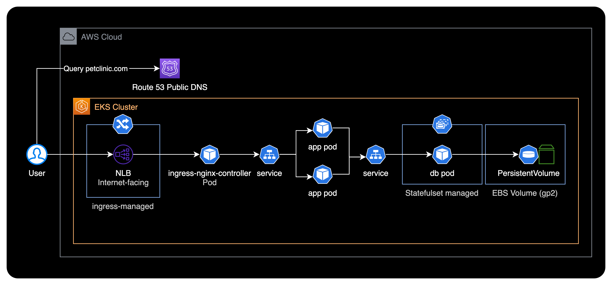

# kakaopaysec-task

## 개요

카카오페이증권 DevOps Engineer 포지션의 과제 전형 결과물입니다.

&nbsp;

## 시스템 아키텍처

Amazon EKS 기반 환경에서 쿠버네티스 클러스터를 구축했습니다.

&nbsp;

## 코드 설명

### 소스 관련

- gradle 버전은 6.8
  - 그러므로 jdk 최소 버전은 8
  - jdk 버전 변경 혹은 설치 대신 docker로 jdk 8 버전 이용하는게 편리
- gradle 빌드도 `gradlew` 사용하여 gradle 버전에 종속적이지 않게 처리한다.
- multi-stage 빌드를 이용하여 어플리케이션 실행은 jre 8 버전 환경에서 한다.
- gradle 빌드 할 때 less를 compile 하지 못한다. 그냥 maven 산출물을 갖다 넣었다.

&nbsp;

### 쿠버네티스 로그

- logrotate는 어플리케이션 logback에서 처리하도록 한다.
- kubectl logs를 위해 STDOUT으로도 나오게 설정한다.
- kubernetes 노드에 STDOUT 로그는 도커 컨테이너 런타임이 정리한다.(10메가, 10개 파일 default, 워커 노드의 /etc/docker/daemon.json 파일에서 확인)
- log는 워커 노드의 `/logs`디렉토리에 적재된다.
- 만약 Pod가 한 워커 노드에 여러개 작동한다면 로그가 중첩되게 되므로 POD_NAME meatadata를 이용한다.

&nbsp;

### 쿠버네티스 health check

- 어플리케이션은 `curl -i GET <DNS>/healthcheck` 명령으로 health 체크 가능하다.
- 어플리케이션은 `curl -i DELETE <DNS>/healthcheck` 명령으로 health를 다운 할 수 있다.
  - 이 경우, k8s의 livenessprobe가 10초마다 체크하면서 3번 연속 실패 할 경우 컨테이너를 재시작 한다.
- 어플리케이션은 `curl -i POST <DNS>/healthcheck` 명령으로 health를 복구 할 수 있다.
- 이 API는 db 연결을 확인하지 않는다. DB에 종속적인 프로그램이 db 문제가 있을 경우 어플리케이션을 재시작 할 필요는 없기 때문이다.

&nbsp;

### graceful shutdown

- 파드가 종료되면 kubelet이 pod에 sigterm 보낸다.
- sigterm을 받으면 새로운 요청을 받지 않아야 하고, 기존 요청은 다 처리되야 한다(종료신호 받고 최대 30초의 요청 처리)
- deployment 포드 스펙에 명시적으로 terminationGracePeriodSeconds: 30 적용 하기
- 어플리케이션은 `curl -i GET <DNS>/20process` 명령으로 20초 소요되는 서비스를 요청 후 파드 종료 혹은 배포 시 정상 처리 된다.

&nbsp;

### 쿠버네티스 DB

- mysql DB 저장소는 AWS EBS를 사용
- 어플리케이션에서 DB 호출은 mysql.default 도메인을 사용한다.
  - 쿠버네티스 클러스터 도메인으로써 내부통신 가능하다.
- 어플리케이션 가동 전, DB가 먼저 가동되어야 한다.
- sql 파일에 table 생성이 작동하면서 테이블을 만들고 insert 한다.
- 그 데이터는 스토리지에 저장된다.
  - DB Pod가 사용할 Persistent Volume은 gp2 타입의 EBS Voulme을 사용한다.
  - gp3 EBS Volume의 경우, 쿠버네티스 클러스터에 EBS CSI Driver의 별도 설치가 필요하기 때문에 기본 제공되는 gp2를 사용한다.

&nbsp;

## 실행방법

### 컨테이너 이미지

- `docker build -t <name>:<version> .`명령으로 빌드한다.
  - `<name>`, `<version>`은 사용자의 환경에 맞게 구성한다.
  - `<name>` 기본값으로 `euffk/petclinic`, `<version>` 기본값으로 `0.0.1` 사용
- ENTRYPOINT는 `/usr/bin/java` CMD로 jar파일 넘겨 준다.
- 컨테이너 이미지를 빌드한다.

&nbsp;

### 컨테이너 이미지 push

- 적절한 이미지 레포지토리에 push 한다.
  - 기본값은 도커 허브에 있는 `euffk/petclinic:0.0.1`이지만 다른 값을 사용한다면
  - `k8s/app/deployment.yaml`파일의 `spec.template.spec.containers.image` 값을 변경하여야 한다.

&nbsp;

### MySQL DB 실행

- `kubectl apply -f k8s/db/sc.yaml` 명령으로 DB가 사용할 스토리지를 만드는 스토리지 클래스를 생성한다.
  - Amazon EKS 환경에서 기본적으로 지원하는 EBS gp2 타입의 볼륨을 Persistent Volume으로 사용했습니다.
- `kubectl apply -f k8s/db/statefulset.yaml`로 스테이트풀셋 생성하고 `kubectl apply -f k8s/db/svc.yaml`로 DB 엔드포인트 생성한다.

&nbsp;

### nginx ingress controller 실행

- `kubectl apply -f k8s/nginx-ingress-controller/` 명령으로 nginx ingress controller 실행한다.
- AWS 리소스인 네트워크 로드 밸런서가 생성된다.
  - Route53에 로드 밸런서의 주소값을 등록한다.
  - 키: `k8s/app/ingress.yaml`파일의 `spec.rules.host`
  - 값: 네트워크 로드 밸런서 주소값

&nbsp;

### 어플리케이션 실행

- `k8s/app/ingress.yaml`파일의 `spec.rules.host` 값을 변경하여야 한다.
- `kubectl apply -f k8s/app/` 명령으로 어플리케이션 pod, 서비스, 인그레스를 실행한다.
